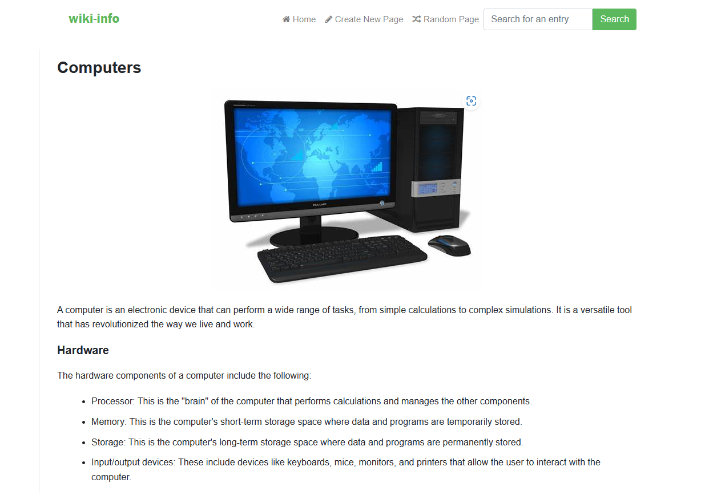

# Wiki-Info

An online encyclopedia powered by the Python Django framework.

## Summary

Wiki-Info is a project that aims to provide an online encyclopedia using the Python Django framework. It offers various features such as viewing available article entries, searching for specific entries, creating new entries, and editing existing entries. Additionally, users can explore random pages for an element of surprise.

For a detailed description of the assignment, you can refer to the [CS50's OpenCourseWare](https://cs50.harvard.edu/web/2020/projects/1/wiki/) page.

## Technologies

- Django
- JavaScript
- HTML
- TailwindCSS

## Implementation

### Entry Page
Visiting `/wiki/TITLE`, where `TITLE` is the title of an encyclopedia entry, displays the content of that specific entry.

### Index Page
The homepage shows a list of all available encyclopedia pages. Users can click on any entry to access its corresponding page.

### New Page
Users can create new encyclopedia entries. They can input the content in Markdown format using a textarea.

### Edit Page
Each entry page provides a link to edit the content of that entry. Clicking the link takes the user to a page where they can modify the Markdown content.

### Random Page
Users can explore a randomly selected encyclopedia entry by clicking the "Random Page" option.

### Markdown to HTML Conversion
Markdown content in each entry is converted to HTML before being displayed. This conversion is performed using the `python-markdown2` package, which can be installed via `pip3 install markdown2`.

## How to Run

To run the project locally, follow these steps:

1. Clone the repository and navigate to the project directory.
2. Install the required packages (Django): `pip install -r requirements.txt`
3. Launch the app locally: `python manage.py runserver`

Feel free to modify and adapt the above instructions based on your specific setup and requirements.
