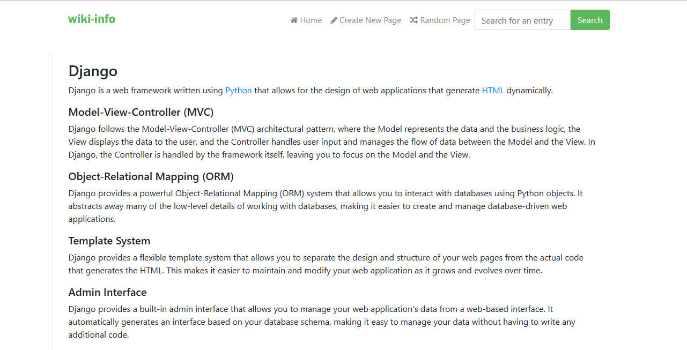

# Wiki-Info
An online encyclopedia using the Python Django framework.

## Summary

The aim of this project was to build an online encyclopedia using the Python Django framework. Users can view available article entries, as well as search for entries on the site. New entries can be created by users, and existing entries can be edited. There is also a 'random page' function that selects and displays a page of the encyclopedia at random.

[View the full assignment description on CS50's OpenCourseWare](https://cs50.harvard.edu/web/2020/projects/1/wiki/)

## Technologies
* Python Django
* Javascript
* HTML
* CSS
* Bootstrap
* 
## Implementation.

### Entry Page
Visiting `/wiki/TITLE`, where `TITLE` is the title of an encyclopedia entry, renders a page that displays the contents of that encyclopedia entry.

### Index Page
The homepage displays the names of all pages in the encyclopedia, user can click on any entry name to be taken directly to that entry page.

### New Page
Allows user to create a new encyclopedia entry. In a textarea, users can be able to enter a Markdown content for the page.

### Edit Page
On each entry page, the user can click a link to be taken to a page where the user can edit its entry’s Markdown content in a textarea.

### Random Page
Allows the user to view a random encyclopedia entry.

### Markdown to HTML Conversion
On each entry’s page, any Markdown content in the entry file can be converted to HTML before being displayed to the user. Used `python-markdown2` package to perform this conversion, installable via `pip3 install markdown2`.

## How to Run
1. Clone this repository, navigate to the project and type the following commands:
2. Install requirements (Django): `pip install -r requirements.txt`
3. Run the app locally: `python manage.py runserver`
